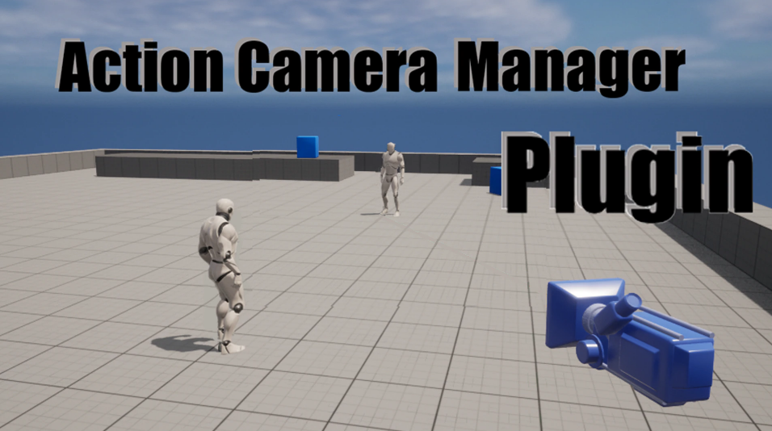

# Action Camera Manager Plugin

## About

※ This plugin is being built on Unreal Engine 5.0.X.

__"Action Camera Manager Plugin"__ is a camera plugin that can be used for various fighting games. There are a total of three modes: __"3D mode"__ used in the same format as the Naruto Ultimate Storm, __"2D mode"__ used in the same format as the Tekken, and __"2D_Fix"__ mode used in the same format as the (old) Tekken. [The video](https://youtu.be/iWDMIVvR27I) will help you understand!

Since I am a student preparing to get a job, it is difficult to update frequently, but if you give me a lot of feedback, I will try to apply it as much as possible. Thank you :)

## Features

* Various camera types are available
* Replicated
* Plugin
* Increased scalability

## Istallation

 - Download the plugin [here](https://drive.google.com/file/d/1NrxuZmrS6tuzRs4NZ0Z7zCMEFtqMklzb/view?usp=sharing)
 - Create a Plugins folder under your project folder
 - Copy the plugin to it, so you have "YourProject/Plugins/ActionCameraManager/"

## Links
* [Documentation](https://github.com/Goaway-1/Action-Camera-Manager-Plugin/wiki)
* [Unreal Engine MarketPlace](https://www.unrealengine.com/marketplace/ko/product/6b542e9ad0b64686b1bf31dca9276316)
* [Preview video](https://youtu.be/iWDMIVvR27I)
* [Example Project](https://drive.google.com/file/d/1HrRBLpvOmTXCnDGXOSHYPz-a87AdoJg8/view?usp=sharing)